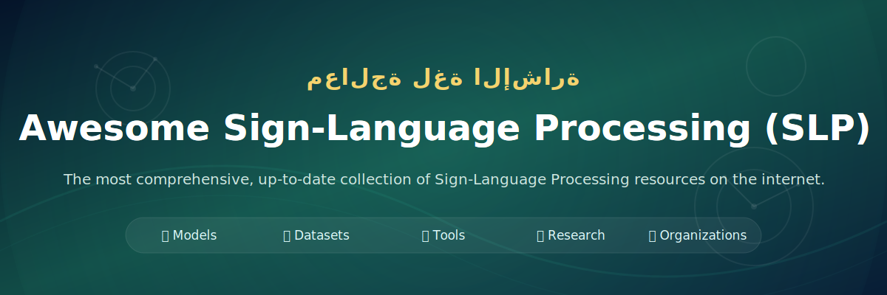

 
 

🚀 **The most comprehensive, up-to-date collection of Sign-Language Processing resources on the internet.** 
Models · Datasets · Tools · Research · Companies

---

## ✦ Project Identity

<table>
<tr>
<td width="33%" valign="top">

**Focus**

Sign-language processing across recognition, translation, synthesis, retrieval, pose, and deployment.

</td>
<td width="33%" valign="top">

**Style**

Minimal filler, clear task boundaries, and tables that are ready for fast curation.

</td>
<td width="33%" valign="top">

**Goal**

Make the list feel like a working index for researchers and builders rather than a static catalog.

</td>
</tr>
</table>

---

## 📑 Table of Contents

<table>
<tr>
<td width="50%" valign="top">

- [🏢 Key Organizations](#-key-organizations)
- [🤖 State-of-the-Art Models](#-state-of-the-art-models)
- [🏆 Benchmarks & Leaderboards](#-benchmarks--leaderboards)
- [📊 Datasets](#-datasets)
- [🔧 Essential Tools & Libraries](#-essential-tools--libraries)
- [📄 Popular Papers](#-popular-papers)
- [✂️ Sign Language Segmentation](#-sign-language-segmentation)
- [🧩 Sign Language Augmentation](#-sign-language-augmentation)
- [🪧 Notation Systems](#-notation-systems)
- [📱 Edge & Mobile Deployment](#-edge--mobile-deployment)
- [🤝 Ethics & Community Co-Design](#-ethics--community-co-design)
- [🏁 Competitions & Workshops](#-competitions--workshops)

</td>
<td width="50%" valign="top">

- [🧭 Pose Estimation, Extraction, and Processing](#-pose-estimation-extraction-and-processing)
- [🔤 Sign-to-Text Projects](#-sign-to-text-projects)
- [👐 Text-to-Sign Projects](#-text-to-sign-projects)
- [🧍 Pose-to-Avatar Conversion](#-pose-to-avatar-conversion)
- [🎓 Tutorials & Learning Resources](#-tutorials--learning-resources)
- [🏛️ Research Institutions](#-research-institutions)
- [🏭 Companies & Startups](#-companies--startups)
- [🌍 Learning Resources by Language](#-learning-resources-by-language)

</td>
</tr>
</table>

---

## 🧭 How To Read This List

| Signal | Meaning | What to add later |
|:---|:---|:---|
| Task | The core problem the resource solves | Recognition, translation, synthesis, retrieval, or tooling |
| Modality | The input or output form | Video, pose, text, gloss, avatar, or multimodal |
| Maturity | How ready the resource is | Paper, code, dataset, benchmark, demo, or product |

---

## 🧱 Editing Rules

| Rule | Why it exists |
|:---|:---|
| Keep one resource per row | Makes scanning and updates faster |
| Group by task first | Sign-language work is task-driven, not name-driven |
| Keep titles short | Prevents the page from becoming noisy |
| Add links only when verified | Keeps the list clean and credible |

---

## 🏢 Key Organizations

> Research labs, universities, community groups, and companies shaping Sign-Language Processing.

| Organization | Category | Focus | Key Contributions | Link |
|:---|:---|:---|:---|:---:|
| TBD | TBD | TBD | TBD | TBD |

---

## 🤖 State-of-the-Art Models

> Core models for recognition, translation, generation, retrieval, and unified sign-language understanding.

| Model | Category | Task | Key Features | Link |
|:---|:---|:---|:---|:---:|
| Uni-Sign | Unified | Understanding | Large-scale unified modeling | [Code](https://github.com/ZechengLi19/Uni-Sign) |
| SignBERT | Recognition | ISLR | Hand-model-aware pre-training | [Paper](https://openaccess.thecvf.com/content/ICCV2021/html/Hu_SignBERT_Pre-Training_of_Hand-Model-Aware_Representation_for_Sign_Language_Recognition_ICCV_2021_paper.html) |
| BEST | Recognition | ISLR | BERT pre-training with coupling tokenization | [Paper](https://ojs.aaai.org/index.php/AAAI/article/view/25470) |
| CVT-SLR | Recognition | CSLR | Contrastive visual-textual alignment | [Code](https://github.com/binbinjiang/CVT-SLR) |
| C2SLR | Recognition | CSLR | Consistency-enhanced continuous recognition | [Paper](https://openaccess.thecvf.com/content/CVPR2022/html/Zuo_C2SLR_Consistency-Enhanced_Continuous_Sign_Language_Recognition_CVPR_2022_paper.html) |
| Sign2GPT | Translation | SLT | LLM-powered gloss-free translation | [Code](https://github.com/ryanwongsa/Sign2GPT/tree/main) |
| SLTUNET | Translation | SLT | Unified translation model | [Code](https://github.com/bzhangGo/sltunet) |
| T2S-GPT | Production | SLP | Autoregressive text-to-sign production | [Project](https://t2sgpt-demo.yinaoxiong.cn/) |
| SignGen | Production | SLP | End-to-end latent diffusion generation | [Code](https://github.com/mingtiannihao/SignGen) |
| SignCLIP | Retrieval | SLR | Text-sign contrastive representation | [Code](https://github.com/J22Melody/fairseq/tree/main/examples/MMPT) |

---

## 🏆 Benchmarks & Leaderboards

> Standardized evaluation resources for sign-language tasks across datasets, languages, and modalities.

| Benchmark | Task Area | Description | Metric(s) | Link |
|:---|:---|:---|:---|:---:|
| WLASL | ISLR | Isolated sign recognition benchmark | Top-1 / Top-5 Accuracy | [Link](https://dxli94.github.io/WLASL/) |
| MSASL | ISLR | Isolated sign recognition benchmark | Top-1 / Top-5 Accuracy | [Link](https://www.microsoft.com/en-us/research/project/ms-asl/) |
| NMFs-CSL | ISLR | Isolated sign recognition benchmark | Accuracy | [Link](https://ustc-slr.github.io/datasets/2020_nmfs_csl/) |
| SLR500 | ISLR | Isolated sign recognition benchmark | Accuracy | [Link](http://home.ustc.edu.cn/~hagjie/) |
| Slovo | ISLR | Isolated sign recognition benchmark | Accuracy | [Link](https://github.com/hukenovs/slovo) |
| ASL Citizen | ISLR | Isolated sign recognition benchmark | Accuracy | [Link](https://www.microsoft.com/en-us/research/project/asl-citizen/) |
| Auslan-Daily | ISLR | Isolated sign recognition benchmark | Accuracy | [Link](https://uq-cvlab.github.io/Auslan-Daily-Dataset/) |
| Phoenix-2014 | CSLR | Continuous sign recognition benchmark | WER | [Link](https://www-i6.informatik.rwth-aachen.de/~koller/RWTH-PHOENIX/) |
| Phoenix-2014T | CSLR / SLT | Continuous recognition and translation benchmark | WER / BLEU / ROUGE | [Link](https://www-i6.informatik.rwth-aachen.de/~koller/RWTH-PHOENIX-2014-T/) |
| CSL-Daily | CSLR / SLT | Continuous recognition and translation benchmark | WER / BLEU | [Link](http://home.ustc.edu.cn/~zhouh156/dataset/csl-daily/) |
| TVB-HKSL-News | CSLR / SLT | Continuous recognition and translation benchmark | WER / BLEU | [Link](https://tvb-hksl-news.github.io/) |
| OpenASL | SLT | Sign language translation benchmark | BLEU / ROUGE | [Link](https://github.com/chevalierNoir/OpenASL/) |
| How2Sign | SLT | Sign language translation benchmark | BLEU / ROUGE | [Link](https://how2sign.github.io/) |
| BOBSL | SLT | Large-scale translation benchmark | BLEU / ROUGE | [Link](https://www.robots.ox.ac.uk/~vgg/data/bobsl/) |
| Auslan-Daily Communication | SLT | Translation benchmark | BLEU / ROUGE | [Link](https://uq-cvlab.github.io/Auslan-Daily-Dataset/) |
| Auslan-Daily News | SLT | Translation benchmark | BLEU / ROUGE | [Link](https://uq-cvlab.github.io/Auslan-Daily-Dataset/) |

---

## 📊 Datasets

> Datasets covering multiple sign languages, sizes, formats, and modalities.

| Dataset | Modality | Sign Language | Size / Scale | Link |
|:---|:---|:---|:---|:---:|
| YouTube-ASL | Video | ASL | Large-scale pre-training corpus | [Link](https://github.com/google-research/google-research/tree/master/youtube_asl) |
| CSL-News | Video | CSL | Large-scale pre-training corpus | [Link](https://huggingface.co/datasets/ZechengLi19/CSL-News) |
| YouTube-SL-25 | Video | Multi-language | Large-scale pre-training corpus | [Link](https://github.com/google-research/google-research/tree/master/youtube_sl_25) |
| WLASL | Video | ASL | Isolated sign dataset | [Link](https://dxli94.github.io/WLASL/) |
| MSASL | Video | ASL | Isolated sign dataset | [Link](https://www.microsoft.com/en-us/research/project/ms-asl/) |
| NMFs-CSL | Video | CSL | Isolated sign dataset | [Link](https://ustc-slr.github.io/datasets/2020_nmfs_csl/) |
| SLR500 | Video | CSL | Isolated sign dataset | [Link](http://home.ustc.edu.cn/~hagjie/) |
| Slovo | Video | RSL | Isolated sign dataset | [Link](https://github.com/hukenovs/slovo) |
| ASL Citizen | Video | ASL | Isolated sign dataset | [Link](https://www.microsoft.com/en-us/research/project/asl-citizen/) |
| Auslan-Daily | Video | Auslan | Isolated sign dataset | [Link](https://uq-cvlab.github.io/Auslan-Daily-Dataset/) |
| Phoenix-2014 | Video | DGS | Continuous sign dataset | [Link](https://www-i6.informatik.rwth-aachen.de/~koller/RWTH-PHOENIX/) |
| Phoenix-2014T | Video | DGS | Continuous sign + translation dataset | [Link](https://www-i6.informatik.rwth-aachen.de/~koller/RWTH-PHOENIX-2014-T/) |
| CSL-Daily | Video | CSL | Continuous sign + translation dataset | [Link](http://home.ustc.edu.cn/~zhouh156/dataset/csl-daily/) |
| TVB-HKSL-News | Video | HKSL | Continuous sign + translation dataset | [Link](https://tvb-hksl-news.github.io/) |
| OpenASL | Video | ASL | Translation dataset | [Link](https://github.com/chevalierNoir/OpenASL/) |
| How2Sign | Video + Multimodal | ASL | Translation dataset | [Link](https://how2sign.github.io/) |
| BOBSL | Video | BSL | Translation dataset | [Link](https://www.robots.ox.ac.uk/~vgg/data/bobsl/) |
| Auslan-Daily Communication | Video | Auslan | Translation dataset | [Link](https://uq-cvlab.github.io/Auslan-Daily-Dataset/) |
| Auslan-Daily News | Video | Auslan | Translation dataset | [Link](https://uq-cvlab.github.io/Auslan-Daily-Dataset/) |

---

## 🔧 Essential Tools & Libraries

> Practical tools for preprocessing, annotation, visualization, pose extraction, and sign-language workflows.

| Tool / Library | Category | Use Case | Platform | Link |
|:---|:---|:---|:---|:---:|
| react-pose-viewer | Pose visualization | View and inspect pose sequences | Web | [Code](https://github.com/bipinkrish/react-pose-viewer) |
| pose-dart | Pose processing | Work with pose data | Dart | [Code](https://github.com/bipinkrish/pose-dart) |
| vscode-pose | VS Code extension | Pose-related editing workflow | VS Code | [Code](https://github.com/bipinkrish/vscode-pose) |
| multimodalhugs | Multimodal tooling | Multimodal experimentation | Unknown | [Code](https://github.com/GerrySant/multimodalhugs) |

---

## 📄 Popular Papers

> Chronological and task-based papers grouped by the problem they solve.

| Paper | Year | Task Area | Venue / Type | Key Link |
|:---|:---:|:---|:---|:---:|
| Deep Sign: Hybrid CNN-HMM for Continuous Sign Language Recognition | 2016 | CSLR | BMVC | [Paper](https://bmva-archive.org.uk/bmvc/2016/papers/paper136/index.html) |
| Iterative Reference Driven Metric Learning for Signer Independent Isolated Sign | 2016 | ISLR | ECCV | [Paper](http://vipl.ict.ac.cn/uploadfile/upload/2018112115134267.pdf) |
| SubUNets: End-To-End Hand Shape and Continuous Sign Language Recognition | 2017 | CSLR | ICCV | [Paper](https://openaccess.thecvf.com/content_iccv_2017/html/Camgoz_SubUNets_End-To-End_Hand_ICCV_2017_paper.html) |
| Recurrent Convolutional Neural Networks for Continuous Sign Language Recognition by Staged Optimization | 2017 | CSLR | CVPR | [Paper](https://openaccess.thecvf.com/content_cvpr_2017/html/Cui_Recurrent_Convolutional_Neural_CVPR_2017_paper.html) |
| Deep Sign: Enabling Robust Statistical Continuous Sign Language Recognition via Hybrid CNN-HMMs | 2018 | CSLR | IJCV | [Paper](https://link.springer.com/article/10.1007/s11263-018-1121-3) |
| Neural Sign Language Translation | 2018 | SLT | CVPR | [Paper](https://openaccess.thecvf.com/content_cvpr_2018/html/Camgoz_Neural_Sign_Language_CVPR_2018_paper.html) |
| GestureGAN for Hand Gesture-to-Gesture Translation in the Wild | 2018 | SLP | ACM MM | [Paper](https://dl.acm.org/doi/abs/10.1145/3240508.3240704) |
| Skeleton-Based Gesture Recognition Using Several Fully Connected Layers with Path Signature Features and Temporal Transformer Module | 2019 | ISLR | AAAI | [Paper](https://ojs.aaai.org/index.php/AAAI/article/view/4878) |
| Iterative Alignment Network for Continuous Sign Language Recognition | 2019 | CSLR | CVPR | [Paper](https://openaccess.thecvf.com/content_CVPR_2019/html/Pu_Iterative_Alignment_Network_for_Continuous_Sign_Language_Recognition_CVPR_2019_paper.html) |
| Weakly Supervised Learning with Multi-Stream CNN-LSTM-HMMs to Discover Sequential Parallelism in Sign Language Videos | 2019 | CSLR | TPAMI | [Paper](https://ieeexplore.ieee.org/document/8691602/) |
| Transferring Cross-Domain Knowledge for Video Sign Language Recognition | 2020 | ISLR | CVPR | [Paper](https://openaccess.thecvf.com/content_CVPR_2020/html/Li_Transferring_Cross-Domain_Knowledge_for_Video_Sign_Language_Recognition_CVPR_2020_paper.html) |
| BSL-1K: Scaling up co-articulated sign language recognition using mouthing cues | 2020 | ISLR | ECCV | [Paper](https://www.ecva.net/papers/eccv_2020/papers_ECCV/html/1279_ECCV_2020_paper.php) |
| Word-level Deep Sign Language Recognition from Video: A New Large-scale Dataset and Methods Comparison | 2020 | ISLR | WACV | [Paper](https://openaccess.thecvf.com/content_WACV_2020/html/Li_Word-level_Deep_Sign_Language_Recognition_from_Video_A_New_Large-scale_WACV_2020_paper.html) |
| FineHand: Learning Hand Shapes for American Sign Language Recognition | 2020 | ISLR | FG | [Paper](https://ieeexplore.ieee.org/document/9320289) |
| Boosting Continuous Sign Language Recognition via Cross Modality Augmentation | 2020 | CSLR | ACM MM | [Paper](https://dl.acm.org/doi/abs/10.1145/3394171.3413931) |
| Stochastic Fine-grained Labeling of Multi-state Sign Glosses for Continuous Sign Language Recognition | 2020 | CSLR | ECCV | [Paper](https://www.ecva.net/papers/eccv_2020/papers_ECCV/html/2527_ECCV_2020_paper.php) |
| Fully Convolutional Networks for Continuous Sign Language Recognition | 2020 | CSLR | ECCV | [Paper](https://www.ecva.net/papers/eccv_2020/papers_ECCV/html/4763_ECCV_2020_paper.php) |
| Spatial-Temporal Multi-Cue Network for Continuous Sign Language Recognition | 2020 | CSLR | AAAI | [Paper](https://ojs.aaai.org/index.php/AAAI/article/view/7001) |
| Sign Language Transformers: Joint End-to-end Sign Language Recognition and Translation | 2020 | SLT | CVPR | [Paper](https://openaccess.thecvf.com/content_CVPR_2020/html/Camgoz_Sign_Language_Transformers_Joint_End-to-End_Sign_Language_Recognition_and_Translation_CVPR_2020_paper.html) |
| TSPNet: Hierarchical Feature Learning via Temporal Semantic Pyramid for Sign Language Translation | 2020 | SLT | NeurIPS | [Paper](https://proceedings.neurips.cc/paper_files/paper/2020/hash/8c00dee24c9878fea090ed070b44f1ab-Abstract.html) |
| Neural Sign Language Translation by Learning Tokenization | 2020 | SLT | FG | [Paper](https://ieeexplore.ieee.org/document/9320278?denied=) |
| Neural Sign Language Synthesis: Words Are Our Glosses | 2020 | SLP | WACV | [Paper](https://openaccess.thecvf.com/content_WACV_2020/papers/Zelinka_Neural_Sign_Language_Synthesis_Words_Are_Our_Glosses_WACV_2020_paper.pdf) |
| Adversarial Training for Multi-Channel Sign Language Production | 2020 | SLP | BMVC | [Paper](https://arxiv.org/abs/2008.12405) |
| Progressive Transformers for End-to-End Sign Language Production | 2020 | SLP | ECCV | [Paper](https://arxiv.org/pdf/2004.14874.pdf) |
| Text2Sign: Towards Sign Language Production Using Neural Machine Translation and Generative Adversarial Networks | 2020 | SLP | IJCV | [Paper](https://link.springer.com/article/10.1007/s11263-019-01281-2#citeas) |
| Hand-Model-Aware Sign Language Recognition | 2021 | ISLR | AAAI | [Paper](https://ojs.aaai.org/index.php/AAAI/article/view/16247) |
| Global-Local Enhancement Network for NMF-Aware Sign Language Recognition | 2021 | ISLR | TOMM | [Paper](https://dl.acm.org/doi/10.1145/3436754) |
| Hand Pose Guided 3D Pooling for Word-level Sign Language Recognition | 2021 | ISLR | WACV | [Paper](https://openaccess.thecvf.com/content/WACV2021/html/Hosain_Hand_Pose_Guided_3D_Pooling_for_Word-Level_Sign_Language_Recognition_WACV_2021_paper.html) |
| Pose-based Sign Language Recognition using GCN and BERT | 2021 | ISLR | WACVW | [Paper](https://openaccess.thecvf.com/content/WACV2021W/HBU/html/Tunga_Pose-Based_Sign_Language_Recognition_Using_GCN_and_BERT_WACVW_2021_paper.html) |
| Skeleton Aware Multi-modal Sign Language Recognition | 2021 | ISLR | CVPRW | [Paper](https://arxiv.org/pdf/2103.08833.pdf) |
| Sign Language Recognition via Skeleton-Aware Multi-Model Ensemble | 2021 | ISLR | arXiv | [Paper](https://arxiv.org/pdf/2110.06161.pdf) |
| SignBERT: Pre-Training of Hand-Model-Aware Representation for Sign Language Recognition | 2021 | ISLR | ICCV | [Paper](https://openaccess.thecvf.com/content/ICCV2021/html/Hu_SignBERT_Pre-Training_of_Hand-Model-Aware_Representation_for_Sign_Language_Recognition_ICCV_2021_paper.html) |
| Visual Alignment Constraint for Continuous Sign Language Recognition | 2021 | CSLR | ICCV | [Paper](https://openaccess.thecvf.com/content/ICCV2021/html/Min_Visual_Alignment_Constraint_for_Continuous_Sign_Language_Recognition_ICCV_2021_paper.html) |
| Self-Mutual Distillation Learning for Continuous Sign Language Recognition | 2021 | CSLR | ICCV | [Paper](https://openaccess.thecvf.com/content/ICCV2021/html/Hao_Self-Mutual_Distillation_Learning_for_Continuous_Sign_Language_Recognition_ICCV_2021_paper.html) |
| Spatial-Temporal Multi-Cue Network for Sign Language Recognition and Translation | 2021 | SLT | TMM | [Paper](https://ieeexplore.ieee.org/document/9354538) |
| Conditional Sentence Generation and Cross-Modal Reranking for Sign Language Translation | 2021 | SLT | TMM | [Paper](https://ieeexplore.ieee.org/document/9447976) |
| How2Sign: A Large-scale Multimodal Dataset for Continuous American Sign Language | 2021 | SLT | CVPR | [Paper](https://openaccess.thecvf.com/content/CVPR2021/html/Duarte_How2Sign_A_Large-Scale_Multimodal_Dataset_for_Continuous_American_Sign_Language_CVPR_2021_paper.html) |
| Improving Sign Language Translation with Monolingual Data by Sign Back-Translation | 2021 | SLT | CVPR | [Paper](https://openaccess.thecvf.com/content/CVPR2021/html/Hu_Model-Aware_Gesture-to-Gesture_Translation_CVPR_2021_paper.html) |
| Skeleton-Aware Neural Sign Language Translation | 2021 | SLT | ACM MM | [Paper](https://dl.acm.org/doi/abs/10.1145/3474085.3475577) |
| SimulSLT: End-to-End Simultaneous Sign Language Translation | 2021 | SLT | ACM MM | [Paper](https://arxiv.org/abs/2112.04228) |
| Towards Fast and High-Quality Sign Language Production | 2021 | SLP | ACM MM | [Paper](https://dl.acm.org/doi/10.1145/3474085.3475463) |
| Mixed SIGNals: Sign Language Production via a Mixture of Motion Primitives | 2021 | SLP | ICCV | [Paper](https://openaccess.thecvf.com/content/ICCV2021/papers/Saunders_Mixed_SIGNals_Sign_Language_Production_via_a_Mixture_of_Motion_ICCV_2021_paper.pdf) |
| Model-Aware Gesture-to-Gesture Translation | 2021 | SLP | CVPR | [Paper](https://openaccess.thecvf.com/content/CVPR2021/html/Hu_Model-Aware_Gesture-to-Gesture_Translation_CVPR_2021_paper.html) |
| Continuous 3D Multi-Channel Sign Language Production via Progressive Transformers and Mixture Density Networks | 2021 | SLP | IJCV | [Paper](https://link.springer.com/article/10.1007/s11263-021-01457-9) |
| Signing Outside the Studio: Benchmarking Background Robustness for Continuous Sign Language Recognition | 2022 | CSLR | BMVC | [Paper](https://bmvc2022.mpi-inf.mpg.de/322/) |
| Temporal Lift Pooling for Continuous Sign Language Recognition | 2022 | CSLR | ECCV | [Paper](https://www.ecva.net/papers/eccv_2022/papers_ECCV/html/160_ECCV_2022_paper.php) |
| Deep Radial Embedding for Visual Sequence Learning | 2022 | CSLR | ECCV | [Paper](https://www.ecva.net/papers/eccv_2022/papers_ECCV/html/5670_ECCV_2022_paper.php) |
| C2SLR: Consistency-Enhanced Continuous Sign Language Recognition | 2022 | CSLR | CVPR | [Paper](https://openaccess.thecvf.com/content/CVPR2022/html/Zuo_C2SLR_Consistency-Enhanced_Continuous_Sign_Language_Recognition_CVPR_2022_paper.html) |
| Prior Knowledge and Memory Enriched Transformer for Sign Language Translation | 2022 | SLT | ACL Findings | [Paper](https://aclanthology.org/2022.findings-acl.297/) |
| Open-Domain Sign Language Translation Learned from Online Video | 2022 | SLT | EMNLP | [Paper](https://aclanthology.org/2022.emnlp-main.427/) |
| Automatic Gloss-level Data Augmentation for Sign Language Translation | 2022 | SLT | LREC | [Paper](https://aclanthology.org/2022.lrec-1.734.pdf) |
| A Simple Multi-Modality Transfer Learning Baseline for Sign Language Translation | 2022 | SLT | CVPR | [Paper](https://openaccess.thecvf.com/content/CVPR2022/html/Chen_A_Simple_Multi-Modality_Transfer_Learning_Baseline_for_Sign_Language_Translation_CVPR_2022_paper.html) |
| MLSLT: Towards Multilingual Sign Language Translation | 2022 | SLT | CVPR | [Paper](https://openaccess.thecvf.com/content/CVPR2022/html/Yin_MLSLT_Towards_Multilingual_Sign_Language_Translation_CVPR_2022_paper.html) |
| Two-Stream Network for Sign Language Recognition and Translation | 2022 | SLT | NeurIPS | [Paper](https://proceedings.neurips.cc/paper_files/paper/2022/hash/6cd3ac24cdb789beeaa9f7145670fcae-Abstract-Conference.html) |
| Sign Language Translation With Hierarchical Spatio-Temporal Graph Neural Network | 2022 | SLT | WACV | [Paper](https://openaccess.thecvf.com/content/WACV2022/html/Kan_Sign_Language_Translation_With_Hierarchical_Spatio-Temporal_Graph_Neural_Network_WACV_2022_paper.html) |
| Sign Language Translation based on Transformers for the How2Sign Dataset | 2022 | SLT | Report | [Paper](https://imatge.upc.edu/web/sites/default/files/pub/xCabot22.pdf) |
| Signing at Scale: Learning to Co-Articulate Signs for Large-Scale Photo-Realistic Sign Language Production | 2022 | SLP | CVPR | [Paper](https://openaccess.thecvf.com/content/CVPR2022/html/Saunders_Signing_at_Scale_Learning_to_Co-Articulate_Signs_for_Large-Scale_Photo-Realistic_CVPR_2022_paper.html) |
| Sign Language Video Retrieval with Free-Form Textual Queries | 2022 | SLR | CVPR | [Paper](https://openaccess.thecvf.com/content/CVPR2022/papers/Duarte_Sign_Language_Video_Retrieval_With_Free-Form_Textual_Queries_CVPR_2022_paper.pdf) |
| Isolated Sign Language Recognition based on Tree Structure Skeleton Images | 2023 | ISLR | CVPRW | [Paper](https://arxiv.org/pdf/2304.05403.pdf) |
| Natural Language-Assisted Sign Language Recognition | 2023 | ISLR | CVPR | [Paper](https://openaccess.thecvf.com/content/CVPR2023/html/Zuo_Natural_Language-Assisted_Sign_Language_Recognition_CVPR_2023_paper.html) |
| Human Part-wise 3D Motion Context Learning for Sign Language Recognition | 2023 | ISLR | ICCV | [Paper](https://openaccess.thecvf.com/content/ICCV2023/papers/Lee_Human_Part-wise_3D_Motion_Context_Learning_for_Sign_Language_Recognition_ICCV_2023_paper.pdf) |
| BEST: BERT Pre-Training for Sign Language Recognition with Coupling Tokenization | 2023 | ISLR | AAAI | [Paper](https://ojs.aaai.org/index.php/AAAI/article/view/25470) |
| Self-Supervised Representation Learning with Spatial-Temporal Consistency for Sign Language Recognition | 2023 | ISLR | TIP | [Paper](https://arxiv.org/pdf/2406.10501) |
| AdaBrowse: Adaptive Video Browser for Efficient Continuous Sign Language Recognition | 2023 | CSLR | ACM MM | [Paper](https://dl.acm.org/doi/10.1145/3581783.3611745) |
| CoSign: Exploring Co-occurrence Signals in Skeleton-based Continuous Sign Language Recognition | 2023 | CSLR | ICCV | [Paper](https://openaccess.thecvf.com/content/ICCV2023/html/Jiao_CoSign_Exploring_Co-occurrence_Signals_in_Skeleton-based_Continuous_Sign_Language_Recognition_ICCV_2023_paper.html) |
| Improving Continuous Sign Language Recognition with Cross-Lingual Signs | 2023 | CSLR | ICCV | [Paper](https://openaccess.thecvf.com/content/ICCV2023/html/Wei_Improving_Continuous_Sign_Language_Recognition_with_Cross-Lingual_Signs_ICCV_2023_paper.html) |
| C2ST: Cross-modal Contextualized Sequence Transduction for Continuous Sign Language Recognition | 2023 | CSLR | ICCV | [Paper](https://openaccess.thecvf.com/content/ICCV2023/html/Zhang_C2ST_Cross-Modal_Contextualized_Sequence_Transduction_for_Continuous_Sign_Language_Recognition_ICCV_2023_paper.html) |
| CVT-SLR: Contrastive Visual-Textual Transformation for Sign Language Recognition with Variational Alignment | 2023 | CSLR | CVPR | [Paper](https://openaccess.thecvf.com/content/CVPR2023/html/Zheng_CVT-SLR_Contrastive_Visual-Textual_Transformation_for_Sign_Language_Recognition_With_Variational_CVPR_2023_paper.html) |
| Continuous Sign Language Recognition with Correlation Network | 2023 | CSLR | CVPR | [Paper](https://openaccess.thecvf.com/content/CVPR2023/html/Hu_Continuous_Sign_Language_Recognition_With_Correlation_Network_CVPR_2023_paper.html) |
| Distilling Cross-Temporal Contexts for Continuous Sign Language Recognition | 2023 | CSLR | CVPR | [Paper](https://openaccess.thecvf.com/content/CVPR2023/html/Guo_Distilling_Cross-Temporal_Contexts_for_Continuous_Sign_Language_Recognition_CVPR_2023_paper.html) |
| Self-Emphasizing Network for Continuous Sign Language Recognition | 2023 | CSLR | AAAI | [Paper](https://ojs.aaai.org/index.php/AAAI/article/view/25164) |
| Prior-Aware Cross Modality Augmentation Learning for Continuous Sign Language Recognition | 2023 | CSLR | TMM | [Paper](https://ieeexplore.ieee.org/document/10105511) |
| SLTUNET: A Simple Unified Model for Sign Language Translation | 2023 | SLT | ICLR | [Paper](https://openreview.net/forum?id=EBS4C77p_5S) |
| Gloss-Free End-to-End Sign Language Translation | 2023 | SLT | ACL | [Paper](https://aclanthology.org/2023.acl-long.722/) |
| Neural Machine Translation Methods for Translating Text to Sign Language Glosses | 2023 | SLT | ACL | [Paper](https://aclanthology.org/2023.acl-long.700/) |
| Considerations for meaningful sign language machine translation based on glosses | 2023 | SLT | ACL | [Paper](https://aclanthology.org/2023.acl-short.60/) |
| ISLTranslate: Dataset for Translating Indian Sign Language | 2023 | SLT | ACL Findings | [Paper](https://aclanthology.org/2023.findings-acl.665/) |
| Cross-modality Data Augmentation for End-to-End Sign Language Translation | 2023 | SLT | EMNLP | [Paper](https://arxiv.org/pdf/2305.11096.pdf) |
| YouTube-ASL: A Large-Scale, Open-Domain American Sign Language-English Parallel Corpus | 2023 | SLT | NeurIPS Datasets | [Paper](https://proceedings.neurips.cc/paper_files/paper/2023/file/5c61452daca5f0c260e683b317d13a3f-Paper-Datasets_and_Benchmarks.pdf) |
| Sign Language Translation from Instructional Videos | 2023 | SLT | CVPRW | [Paper](https://openaccess.thecvf.com/content/CVPR2023W/WiCV/papers/Tarres_Sign_Language_Translation_from_Instructional_Videos_CVPRW_2023_paper.pdf) |
| Gloss Attention for Gloss-free Sign Language Translation | 2023 | SLT | CVPR | [Paper](https://openaccess.thecvf.com/content/CVPR2023/html/Yin_Gloss_Attention_for_Gloss-Free_Sign_Language_Translation_CVPR_2023_paper.html) |
| Gloss-free Sign Language Translation: Improving from Visual-Language Pretraining | 2023 | SLT | ICCV | [Paper](https://openaccess.thecvf.com/content/ICCV2023/html/Zhou_Gloss-Free_Sign_Language_Translation_Improving_from_Visual-Language_Pretraining_ICCV_2023_paper.html) |
| CiCo: Domain-Aware Sign Language Retrieval via Cross-Lingual Contrastive Learning | 2023 | SLR | CVPR | [Paper](https://arxiv.org/pdf/2303.12793.pdf) |
| SignBERT+: Hand-model-aware Self-supervised Pre-training for Sign Language Understanding | 2023 | Unified | TPAMI | [Paper](https://ieeexplore.ieee.org/document/10109128) |
| MASA: Motion-aware Masked Autoencoder with Semantic Alignment for Sign Language Recognition | 2024 | ISLR | TCSVT | [Paper](https://arxiv.org/pdf/2405.20666) |
| Towards Online Continuous Sign Language Recognition and Translation | 2024 | CSLR | EMNLP | [Paper](https://aclanthology.org/2024.emnlp-main.619.pdf) |
| Sign Language Translation with Sentence Embedding Supervision | 2024 | SLT | ACL | [Paper](https://aclanthology.org/2024.acl-short.40.pdf) |
| Sign2GPT: Leveraging Large Language Models for Gloss-Free Sign Language Translation | 2024 | SLT | ICLR | [Paper](https://openreview.net/forum?id=LqaEEs3UxU) |
| Conditional Variational Autoencoder for Sign Language Translation with Cross-Modal Alignment | 2024 | SLT | AAAI | [Paper](https://arxiv.org/pdf/2312.15645.pdf) |
| Factorized Learning Assisted with Large Language Model for Gloss-free Sign Language Translation | 2024 | SLT | LREC-COLING | [Paper](https://arxiv.org/pdf/2403.12556.pdf) |
| Towards Privacy-Aware Sign Language Translation at Scale | 2024 | SLT | ACL | [Paper](https://arxiv.org/pdf/2402.09611) |
| LLMs are Good Sign Language Translators | 2024 | SLT | CVPR | [Paper](https://arxiv.org/pdf/2404.00925) |
| Improving Gloss-free Sign Language Translation by Reducing Representation Density | 2024 | SLT | NeurIPS | [Paper](https://openreview.net/forum?id=FtzLbGoHW2) |
| Scaling Sign Language Translation | 2024 | SLT | NeurIPS | [Paper](https://openreview.net/forum?id=M80WgiO2Lb) |
| Visual Alignment Pre-training for Sign Language Translation | 2024 | SLT | ECCV | [Paper](https://www.ecva.net/papers/eccv_2024/papers_ECCV/papers/05894.pdf) |
| EvSign: Sign Language Recognition and Translation with Streaming Events | 2024 | SLT | ECCV | [Paper](https://www.ecva.net/papers/eccv_2024/papers_ECCV/papers/00799.pdf) |
| Sign Language Production with Latent Motion Transformer | 2024 | SLP | WACV | [Paper](https://arxiv.org/pdf/2312.12917.pdf) |
| SignAvatar: Sign Language 3D Motion Reconstruction and Generation | 2024 | SLP | FG | [Paper](https://arxiv.org/pdf/2405.07974) |
| Select and Reorder: A Novel Approach for Neural Sign Language Production | 2024 | SLP | LREC-COLING | [Paper](https://arxiv.org/pdf/2404.11532) |
| T2S-GPT: Dynamic Vector Quantization for Autoregressive Sign Language Production from Text | 2024 | SLP | ACL | [Paper](https://arxiv.org/pdf/2406.07119) |
| G2P-DDM: Generating Sign Pose Sequence from Gloss Sequence with Discrete Diffusion Model | 2024 | SLP | AAAI | [Paper](https://arxiv.org/pdf/2208.09141) |
| SignGen: End-to-End Sign Language Video Generation with Latent Diffusion | 2024 | SLP | ECCV | [Paper](https://www.ecva.net/papers/eccv_2024/papers_ECCV/papers/06988.pdf) |
| A Simple Baseline for Spoken Language to Sign Language Translation with 3D Avatars | 2024 | SLP | ECCV | [Paper](https://www.ecva.net/papers/eccv_2024/papers_ECCV/papers/06499.pdf) |
| SEDS: Semantically Enhanced Dual-Stream Encoder for Sign Language Retrieval | 2024 | SLR | ACM MM | [Paper](https://arxiv.org/pdf/2407.16394) |
| Uncertainty-aware Sign Language Video Retrieval with Probability Distribution Modeling | 2024 | SLR | ECCV | [Paper](https://www.ecva.net/papers/eccv_2024/papers_ECCV/papers/06074.pdf) |
| SignCLIP: Connecting Text and Sign Language by Contrastive Learning | 2024 | SLR | EMNLP | [Paper](https://arxiv.org/pdf/2407.01264) |
| VSNet: Focusing on the Linguistic Characteristics of Sign Language | 2025 | ISLR | CVPR | [Paper](https://openaccess.thecvf.com/content/CVPR2025/papers/Li_VSNet_Focusing_on_the_Linguistic_Characteristics_of_Sign_Language_CVPR_2025_paper.pdf) |
| Cross-Modal Consistency Learning for Sign Language Recognition | 2025 | ISLR | CVPRW | [Paper](https://openaccess.thecvf.com/content/CVPR2025W/SLRTP/papers/Wu_Cross-Modal_Consistency_Learning_for_Sign_Language_Recognition_CVPRW_2025_paper.pdf) |
| KD-MSLRT: Lightweight Sign Language Recognition Model Based on Mediapipe and 3D to 1D Knowledge Distillation | 2025 | CSLR | AAAI | [Paper](https://arxiv.org/pdf/2501.02321) |
| A Signer-Invariant Conformer and Multi-Scale Fusion Transformer for Continuous Sign Language Recognition | 2025 | CSLR | ICCVW | [Paper](https://arxiv.org/pdf/2508.09372) |
| A Closer Look at Skeleton-based Continuous Sign Language Recognition | 2025 | CSLR | ICCVW | N/A |
| Beyond Gloss: A Hand-Centric Framework for Gloss-Free Sign Language Translation | 2025 | SLT | BMVC | [Paper](https://arxiv.org/pdf/2507.23575) |
| Improvement in Sign Language Translation Using Text CTC Alignment | 2025 | SLT | COLING | [Paper](https://arxiv.org/pdf/2412.09014) |
| Lost in Translation, Found in Context: Sign Language Translation with Contextual Cues | 2025 | SLT | CVPR | [Paper](https://arxiv.org/pdf/2501.09754) |
| Multilingual Gloss-free Sign Language Translation: Towards Building a Sign Language Foundation Model | 2025 | SLT | ACL | [Paper](https://arxiv.org/pdf/2505.24355) |
| SHuBERT: Self-Supervised Sign Language Representation Learning via Multi-Stream Cluster Prediction | 2025 | SLT | ACL | [Paper](https://arxiv.org/pdf/2411.16765) |
| An Efficient Gloss-Free Sign Language Translation Using Spatial Configurations and Motion Dynamics with LLMs | 2025 | SLT | NAACL | [Paper](https://aclanthology.org/2025.naacl-long.197.pdf) |
| SONAR-SLT: Multilingual Sign Language Translation via Language-Agnostic Sentence Embedding Supervision | 2025 | SLT | WMT | [Paper](https://aclanthology.org/2025.wmt-1.18.pdf) |
| SAGE: Segment-Aware Gloss-Free Encoding for Token-Efficient Sign Language Translation | 2025 | SLT | ICCVW | [Paper](https://www.arxiv.org/pdf/2507.09266) |
| Geo-Sign: Hyperbolic Contrastive Regularisation for Geometrically-Aware Sign-Language Translation | 2025 | SLT | NeurIPS | [Paper](https://arxiv.org/pdf/2506.00129) |
| Sign-IDD: Iconicity Disentangled Diffusion for Sign Language Production | 2025 | SLP | AAAI | [Paper](https://arxiv.org/pdf/2412.13609) |
| Discrete to Continuous: Generating Smooth Transition Poses from Sign Language Observations | 2025 | SLP | CVPR | [Paper](https://arxiv.org/pdf/2411.16810) |
| SLRTP2025 Sign Language Production Challenge: Methodology, Results, and Future Work | 2025 | SLP | CVPRW | [Paper](https://arxiv.org/pdf/2508.06951) |
| Signs as Tokens: A Retrieval-Enhanced Multilingual Sign Language Generator | 2025 | SLP | ICCV | [Paper](https://openaccess.thecvf.com/content/ICCV2025/papers/Zuo_Signs_as_Tokens_A_Retrieval-Enhanced_Multilingual_Sign_Language_Generator_ICCV_2025_paper.pdf) |
| Scaling up Multimodal Pre-training for Sign Language Understanding | 2025 | Unified | TPAMI | [Paper](https://arxiv.org/pdf/2408.08544) |
| Uni-Sign: Toward Unified Sign Language Understanding at Scale | 2025 | Unified | ICLR | [Paper](https://openreview.net/pdf?id=0Xt7uT04cQ) |

---

## ✂️ Sign Language Segmentation

> Resources for segmenting signs, glosses, motions, and temporal boundaries.

| Resource | Subtask | Input Type | Output Type | Link |
|:---|:---|:---|:---|:---:|
| signlang-segmenter (24-mohamedyehia) | Sign language segmentation | Video | Segmented sign units / boundaries | [Code](https://github.com/24-mohamedyehia/signlang-segmenter) |
| sign-segmentation (RenzKa) | Sign language segmentation | Video | Segmented sign units / boundaries | [Code](https://github.com/RenzKa/sign-segmentation) |
| sign-segmentation (bricksdont) | Sign language segmentation | Video | Segmented sign units / boundaries | [Code](https://github.com/bricksdont/sign-segmentation) |
---

## 🧩 Sign Language Augmentation

> Techniques and tools for improving data diversity and model robustness.

| Resource | Augmentation Type | Input Modality | Purpose | Link |
|:---|:---|:---|:---|:---:|
| signlang-augmenter | Sign language augmentation | Video / Pose | Data augmentation workflows | [Code](https://github.com/24-mohamedyehia/signlang-augmenter) |

---

## 🧭 Pose Estimation, Extraction, and Processing

> Tools and pipelines for extracting, cleaning, and using pose/keypoint data.

| Resource | Processing Stage | Input | Output | Link |
|:---|:---|:---|:---|:---:|
| SL-TSSI-DenseNet | Skeleton image transformation | Pose / Skeleton | Isolated sign classes | [Code](https://github.com/davidlainesv/SL-TSSI-DenseNet) |
| SignAvatar | 3D motion reconstruction | Video | 3D sign motion | [Project](https://dongludeeplearning.github.io/SignAvatar.html) |
| G2P-DDM | Gloss-to-pose generation | Gloss | Pose sequence | [Project](https://slpdiffusier.github.io/g2p-ddm/) |
| MediaPipe | Pose extraction / on-device | Video | 2D/3D pose keypoints | [Code](https://github.com/google-ai-edge/mediapipe) |
| OpenPose | Multi-person pose estimation | Video | 2D pose keypoints | [Code](https://github.com/CMU-Perceptual-Computing-Lab/openpose) |
| AlphaPose | Multi-person / realtime pose | Video | 2D/3D pose keypoints | [Code](https://github.com/MVIG-SJTU/AlphaPose) |
| MMPose | Research toolbox for pose | Video | 2D/3D pose keypoints | [Code](https://github.com/open-mmlab/mmpose) |
| Blaze2Cap_AI_Motioner | Pose→motion / captioning pipeline | Video | Motion outputs / captions | [Code](https://github.com/BlazeWild/Blaze2Cap_AI_Motioner) |
| EasyMocap | Multi-person 3D mocap | Video | 3D motion / skeletons | [Code](https://github.com/zju3dv/EasyMocap) |
| Monocular_3D_human | Monocular 3D reconstruction | Video | 3D human meshes / poses | [Code](https://github.com/zju3dv/Monocular_3D_human) |
| HybrIK | 3D pose estimation + IK | Video | 3D joint poses / IK output | [Code](https://github.com/jeffffffli/HybrIK) |
| sapiens (FacebookResearch) | Human body modeling | 3D data / meshes | Parametric human models / assets | [Code](https://github.com/facebookresearch/sapiens) |

---

## 🔤 Sign-to-Text Projects

> Recognition and translation projects for isolated and continuous sign-language inputs.

| Project | Task Type | Input Modality | Output | Link |
|:---|:---|:---|:---|:---:|
| VAC_CSLR | Continuous recognition | Video | Gloss sequence | [Code](https://github.com/ycmin95/VAC_CSLR) |
| Temporal-Lift-Pooling | Continuous recognition | Video | Gloss sequence | [Code](https://github.com/hulianyuyy/Temporal-Lift-Pooling) |
| AdaBrowse | Continuous recognition | Video | Gloss sequence | [Code](https://github.com/hulianyuyy/AdaBrowse) |
| CVT-SLR | Continuous recognition | Video + Text | Gloss sequence | [Code](https://github.com/binbinjiang/CVT-SLR) |
| CorrNet | Continuous recognition | Video | Gloss sequence | [Code](https://github.com/hulianyuyy/CorrNet) |
| SLRT | Recognition + Translation | Video | Gloss / Text | [Code](https://github.com/FangyunWei/SLRT) |
| TwoStreamNetwork | Recognition + Translation | Video + Pose | Gloss / Text | [Code](https://github.com/FangyunWei/SLRT/tree/main/TwoStreamNetwork) |
| Uni-Sign | Unified understanding | Video + Text | Multi-task outputs | [Code](https://github.com/ZechengLi19/Uni-Sign) |

---

## 👐 Text-to-Sign Projects

> Systems that generate sign-language output from text, glosses, or intermediate representations.

| Project | Task Type | Input | Output | Link |
|:---|:---|:---|:---|:---:|
| ProgressiveTransformersSLP | Sign production | Text / Gloss | Pose / Motion sequence | [Code](https://github.com/BenSaunders27/ProgressiveTransformersSLP) |
| SANet | Sign translation | Video / Pose | Text | [Code](https://github.com/SignLanguageCode/SANet) |
| SimulSLT | Simultaneous translation | Video | Text | [Code](https://github.com/Robert0125/SimulSLT) |
| PET | Sign translation | Video | Text | [Code](https://github.com/hugddygff/PET) |
| OpenASL | Open-domain translation | Video | Text | [Code](https://github.com/chevalierNoir/OpenASL) |
| MLSLT SP-10 | Multilingual translation | Video | Text | [Code](https://github.com/MLSLT/SP-10) |
| SLTUNET | Sign translation | Video | Text | [Code](https://github.com/bzhangGo/sltunet) |
| GloFE | Gloss-free translation | Video | Text | [Code](https://github.com/HenryLittle/GloFE) |
| ISLTranslate | Translation dataset + baseline | Video | Text | [Code](https://github.com/Exploration-Lab/ISLTranslate) |
| GASLT | Gloss-free translation | Video | Text | [Code](https://github.com/YinAoXiong/GASLT) |
| GFSLT-VLP | Gloss-free translation | Video | Text | [Code](https://github.com/zhoubenjia/GFSLT-VLP) |
| Sign2GPT | LLM-based gloss-free translation | Video | Text | [Code](https://github.com/ryanwongsa/Sign2GPT/tree/main) |
| CV-SLT | Cross-modal aligned translation | Video | Text | [Code](https://github.com/rzhao-zhsq/CV-SLT) |
| SSVP-SLT | Privacy-aware translation | Video | Text | [Code](https://github.com/facebookresearch/ssvp_slt) |
| BeyondGloss | Hand-centric gloss-free translation | Video | Text | [Code](https://github.com/elsobhano/BeyondGloss) |
| TextCTC-SLT | Text CTC aligned translation | Video | Text | [Code](https://github.com/Claire874/TextCTC-SLT) |
| Gloss-free-MLSLT | Multilingual gloss-free translation | Video | Text | [Code](https://github.com/Claire874/Gloss-free-MLSLT) |
| SpaMo | Spatial-motion translation with LLMs | Video | Text | [Code](https://github.com/eddie-euijun-hwang/SpaMo) |
| sonar-slt | Language-agnostic multilingual translation | Video | Text | [Code](https://github.com/DFKI-SignLanguage/sonar-slt) |
| Geo-Sign | Geometrically-aware translation | Video | Text | [Code](https://github.com/ed-fish/Geo-Sign) |

---

## 🧍 Pose-to-Avatar Conversion

> Projects that convert pose or keypoints into animated sign-language avatars.

| Project | Conversion Type | Input | Avatar / Engine | Link |
|:---|:---|:---|:---|:---:|
| SignAvatar | 3D motion reconstruction & generation | Video | 3D body & hand motion pipeline | [Project](https://dongludeeplearning.github.io/SignAvatar.html) |
| T2S-GPT | Text → sign motion generation | Text | Autoregressive sign motion | [Project](https://t2sgpt-demo.yinaoxiong.cn/) |
| G2P-DDM | Gloss → pose diffusion generator | Gloss | Pose sequence generator | [Project](https://slpdiffusier.github.io/g2p-ddm/) |
| SignGen | Sign representation → video generator | Latent sign tokens | Diffusion video generator | [Code](https://github.com/mingtiannihao/SignGen) |
| SOKE | Retrieval-enhanced generator | Text / Retrieval context | Token-based sign generation | [Code](https://github.com/2000ZRL/SOKE) |
| UPose | Pose transfer / avatar input pipeline | Pose | Avatar-ready poses | [Code](https://github.com/digitalworlds/UPose) |
| DigiHuman | Character pipeline / avatar tooling | Pose / Motion | 3D character outputs | [Code](https://github.com/Danial-Kord/DigiHuman) |
| upose (PyPI) | Python package for UPose | Pose | Utilities / PyPI package | [PyPI](https://pypi.org/project/upose/0.1.0/) |
| Real-Time-Motion-Transfer-to-a-3D-Avatar | Real-time motion transfer | Video | 3D avatar motion | [Code](https://github.com/BlazeWild/Real-Time-Motion-Transfer-to-a-3D-Avatar) |
| mediapipe-to-mixamo | MediaPipe → Mixamo bridge | Pose | Mixamo-ready motion | [Code](https://github.com/Nor-s/mediapipe-to-mixamo) |
| Anim | Avatar animation utilities | Pose / Motion | Animation tools | [Code](https://github.com/Nor-s/Anim) |
| Godot 3D mannequin demos | Engine integration examples | Pose / Motion | Godot avatar demos | [Code](https://github.com/gdquest-demos/godot-3d-mannequin) |
| Mixamo | Motion marketplace & retargeting | Motion packs | Retargeted avatar animations | [Site](https://www.mixamo.com/#/?page=1&type=Motion%2CMotionPack) |
| mediapipe-avatar | MediaPipe → avatar helpers | Pose | Avatar tooling | [Code](https://github.com/k03302/mediapipe-avatar) |
| Freemocap | Markerless mocap for avatars | Video | 3D mocap outputs | [Code](https://github.com/freemocap/freemocap) |
| 3D_Character_Animation_Using_MediaPipe | MediaPipe animation example | Video | 3D character animation | [Code](https://github.com/rihemar/3D_Character_Animation_Using_MediaPipe) |
| three.js + MediaPipe | Web avatar integration | Pose | three.js avatar demos | [Code](https://github.com/donguk071/three.js-with-mediapipe) |
| Kalidokit | Retargeting & runtime rigging | Pose / Face | Avatar rig helpers | [Code](https://github.com/yeemachine/kalidokit) |
| Mesekai | Avatar framework / demo | Avatar system | Avatar assets & tools | [Code](https://github.com/Neleac/Mesekai) |
| VRM (what is VRM) | Avatar format overview | — | VRM avatar spec / ecosystem | [Info](https://avatar.viverse.com/avatar/what-is-vrm) |
| VRoid (Mobile / Studio) | Avatar authoring tools | — | VRoid avatars / studio | [Mobile](http://vroid.com/en/mobile) / [Studio](https://vroid.com/en/studio) |
| TurboSquid | 3D asset marketplace | — | 3D models & assets | [Site](https://www.turbosquid.com/) |
| CWA Signing Avatars | Research / avatar examples | — | Signing avatar resources | [Paper / Site](https://vh.cmp.uea.ac.uk/index.php/CWA_Signing_Avatars) |
| three-gltf-viewer | GLTF viewer for avatars | GLTF | Viewer for avatar models | [Code](https://github.com/donmccurdy/three-gltf-viewer) |
| gltf-viewer (online) | GLTF visualizer | GLTF | Model preview | [Viewer](https://gltf-viewer.donmccurdy.com/) |
| model-viewer (Google) | Web component for 3D models | GLTF / USDZ | Web avatar rendering | [Code](https://github.com/google/model-viewer) |
---

## 🤟 Notation Systems

> Writing systems and formal representations used to encode sign language in symbolic form.

| System | Type | What it represents | Typical Use | Link |
|:---|:---|:---|:---|:---:|
| signwriting-flutter | Library | SignWriting notation | Flutter apps and rendering | [Code](https://github.com/bipinkrish/signwriting-flutter) |
| signwriting-dart | Library | SignWriting notation | Dart apps and rendering | [Code](https://github.com/bipinkrish/signwriting-dart) |

---

## 🎓 Tutorials & Learning Resources

> Practical learning material for researchers, engineers, and students.

| Resource | Format | Topic | Audience | Link |
|:---|:---|:---|:---|:---:|
| TBD | TBD | TBD | TBD | TBD |

---

## 🏛️ Research Institutions

> Academic and research groups working on sign-language processing.

| Institution | Type | Country / Region | Focus | Link |
|:---|:---|:---|:---|:---:|
| TBD | TBD | TBD | TBD | TBD |

---

## 🏭 Companies & Startups

> Commercial teams and startups building sign-language technology.

| Company | Category | Focus | Notable Products | Link |
|:---|:---|:---|:---|:---:|
| Mind Rockets Inc | Assistive Tech / AI | Sign Language Avatars & Accessibility Tools | Sign Language Interpreting Avatars, Accessibility Toolbar | [Link](https://main.mindrocketsinc.com/) |
| Hand Talk | Assistive Tech / AI | Automatic Sign Language Translation | Hand Talk App, Hand Talk Plugin | [Link](https://www.handtalk.me/) |

---

## 🌍 Learning Resources by Language

> Resources grouped by sign language and spoken language coverage.

| Language / Variant | Resource Type | Focus | Notes | Link |
|:---|:---|:---|:---|:---:|
| TBD | TBD | TBD | TBD | TBD |

---

## 📱 Edge & Mobile Deployment

> Lightweight pipelines, on-device inference, and mobile-first sign-language experiences.

| Project / Tool | Platform | Deployment Target | Use Case | Link |
|:---|:---|:---|:---|:---:|
| TBD | TBD | TBD | TBD | TBD |

---

## 🏁 Competitions & Workshops

> Shared tasks, benchmark challenges, hackathons, and research workshops.

| Event | Type | Year | Focus | Link |
|:---|:---|:---:|:---|:---:|
| SLRTP2025 Sign Language Production Challenge | Challenge | 2025 | Sign language production | [Paper](https://arxiv.org/pdf/2508.06951) |

## 🤝 Contributing

Contributions will be organized by the sections above. Each resource should include a short description, task category, and a working link once the content is added.

---

## 📜 License

This work is licensed under a Creative Commons Attribution 4.0 International License.

---

**If you find this resource helpful, please give it a ⭐**

Made for the Sign Language Processing community

